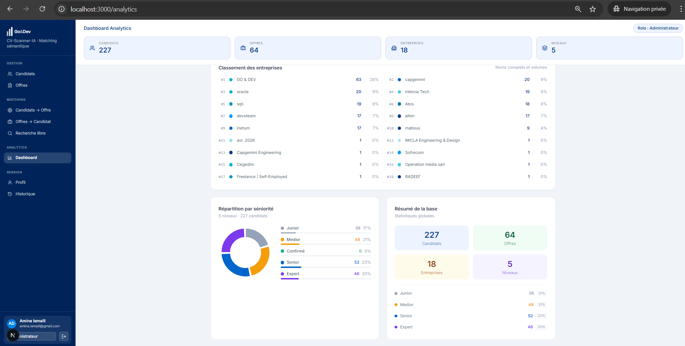
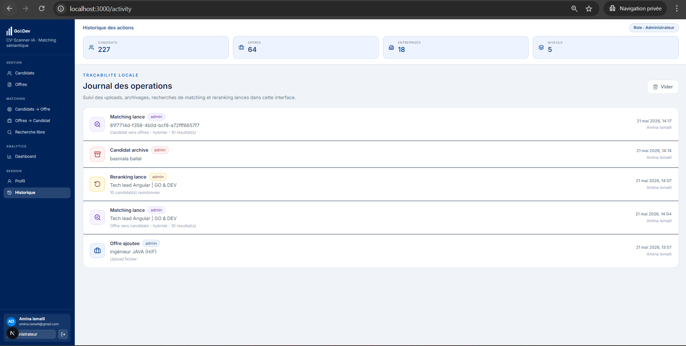

# Dashboard Analytics

La page Analytics donne une vue synthetique de la base active.



*Vue analytique des candidats, offres, entreprises et niveaux de seniorite.*

## Fonctionnalites

- nombre total de candidats ;
- nombre total d'offres ;
- nombre d'entreprises ;
- repartition par niveau ;
- classement des entreprises ;
- volumes par entreprise.

## API Utilisee

```text
GET /api/stats/
```

Cette route alimente les KPIs et les graphiques.

## Valeur Pour Le Jury

Cette page montre que le projet n'est pas seulement un moteur de matching. Il propose aussi une vision analytique utile pour piloter la base RH.



*Suivi des activites recentes et des actions realisees dans l'application.*

## Fichier Principal

```text
src/app/analytics/page.tsx
```
