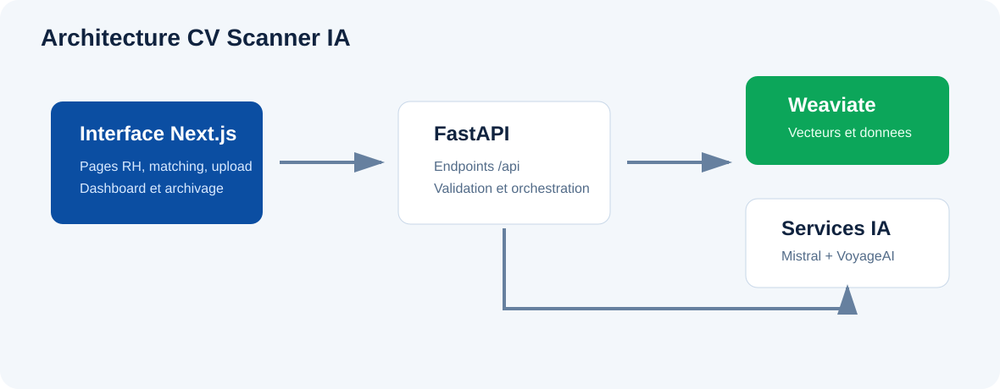

# CV Scanner IA

CV Scanner IA est une plateforme de gestion et de matching intelligent entre candidats et offres d'emploi IT. Elle automatise l'analyse des CV et des offres, structure les informations avec l'IA, stocke les profils dans une base vectorielle, puis fournit une application web Next.js pour exploiter les données au quotidien.

La solution répond à un besoin simple : aider les équipes RH et techniques à identifier plus rapidement les bons candidats pour une offre, ou les meilleures opportunités pour un candidat, avec des résultats consultables, explicables et traçables.

## Vision Produit

Le projet s'organise autour d'un pipeline complet :

- ingestion de CV et d'offres depuis des fichiers ou URLs ;
- extraction des informations importantes avec Mistral ;
- validation, normalisation et détection des doublons ;
- insertion dans Weaviate ;
- stockage sémantique et vectorisation des dimensions métier ;
- recherche textuelle, vectorielle et hybride ;
- matching bidirectionnel candidat-offre ;
- scoring multicritères, reranking et analyse LLM ;
- orchestration des traitements avec LangGraph ;
- exploitation dans une interface web Next.js.

Cette approche évite de limiter l'application à une simple liste de CV. Le système devient un outil d'aide à la décision, capable de comparer les profils et les besoins d'une offre sur plusieurs dimensions : compétences, langages, expérience, rôle, résumé, industrie et trajectoire.

## Architecture Applicative



```text
Fichiers CV / Offres
        |
        v
API FastAPI
        |
        +--> Extraction texte
        +--> Extraction IA Mistral
        +--> Validation métier
        +--> CRUD et archivage
        +--> Recherche et matching
        +--> Workflows LangGraph
        |
        v
Weaviate
        |
        +--> Collection Candidate
        +--> Collection Job
        +--> Vecteurs VoyageAI
        |
        v
Application web Next.js
```

FastAPI expose les services REST, Weaviate conserve les données et les vecteurs, les services IA enrichissent l'extraction et l'analyse, LangGraph orchestre les traitements complexes, et l'application Next.js expose les fonctionnalités dans une interface exploitable par les utilisateurs.

## Chaîne De Traitement

### Traitement D'Un CV

```text
CV PDF/DOCX/TXT
  -> extraction du texte
  -> extraction JSON par Mistral
  -> contrôle du nom candidat
  -> mapping vers CandidatePayload
  -> détection de doublons
  -> insertion dans la collection Candidate
  -> vectorisation automatique
  -> disponibilité pour le matching
```

Le backend empêche l'insertion d'un candidat si le nom reste invalide après extraction et fallback. Cette validation protège la qualité de la base et évite les profils inutilisables.

### Traitement D'Une Offre

```text
Offre PDF/DOCX/TXT
  -> extraction du texte
  -> extraction JSON par Mistral
  -> contrôle du titre de l'offre
  -> mapping vers JobPayload
  -> détection de doublons
  -> insertion dans la collection Job
  -> vectorisation automatique
  -> disponibilité pour le matching
```

Une offre sans titre valide est rejetée avant insertion. Le système conserve ainsi des objets exploitables dans les listes, les recherches et les tableaux de bord.

## Modules Fonctionnels

| Module | Rôle |
| --- | --- |
| Upload | Ajouter un candidat ou une offre depuis un fichier |
| Extraction IA | Transformer un texte brut en données structurées |
| CRUD | Insérer, consulter et archiver les objets |
| List | Alimenter les listes, détails et statistiques |
| Matching | Comparer candidats et offres en texte, vecteur ou hybride |
| Reranking | Réordonner les résultats avec VoyageAI |
| Workflows LangGraph | Orchestrer l'ingestion, le matching, le reranking et les explications |
| LLM | Expliquer un match ou analyser les écarts |
| Dashboard | Suivre les volumes et répartitions de la base |
| Interface Next.js | Centraliser l'exploitation métier dans une application web |

## Expérience Utilisateur

L'application web Next.js fournit l'espace de travail principal :

- tableau de bord analytique ;
- gestion des candidats ;
- gestion des offres ;
- upload de CV et d'offres ;
- recherche rapide dans les listes ;
- matching offre vers candidats ;
- matching candidat vers offres ;
- affichage des scores et détails ;
- copie des UUID pour diagnostic ;
- archivage des éléments.

L'interface arrive en dernière couche de l'architecture : elle ne remplace pas le backend, elle le rend utilisable. Les calculs de matching, la vectorisation, les validations et les appels IA restent centralisés côté API.

## Organisation De La Documentation

La documentation suit la logique du produit :

| Section | Contenu |
| --- | --- |
| Projet | Présentation générale, architecture et installation |
| Backend et API | Endpoints, Swagger, upload, recherche, LLM et workflows LangGraph |
| Base vectorielle | Collections Weaviate, tenants, named vectors |
| Interface Next.js | Pages, composants, workflows utilisateur |
| Exploitation | Démonstrations Loom, publication et vérification fonctionnelle |

Cette progression permet de comprendre d'abord le système, puis les services techniques, puis l'application web qui les exploite.
