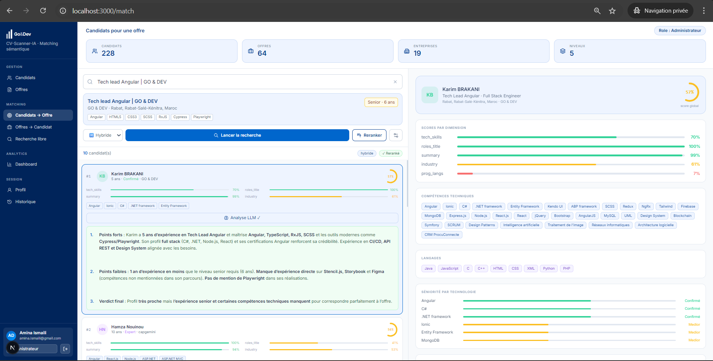
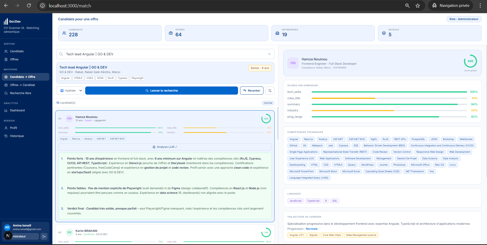
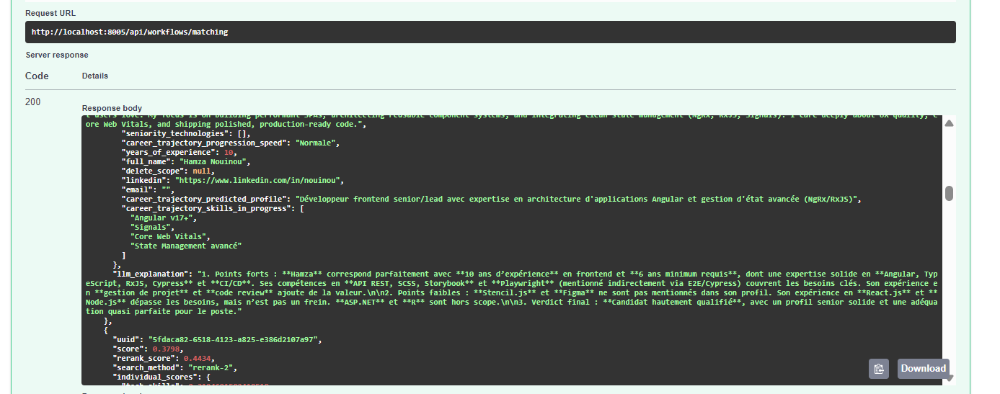

# Reranking Et LLM

Le systeme ajoute une couche d'aide intelligente apres le matching.



*Affichage d'un resultat de matching enrichi par une explication LLM.*

## Reranking

Le reranking reordonne les resultats initiaux avec VoyageAI.

```text
POST /api/search/rerank/
```

Utilisation dans l'interface :

- page Offre -> Candidats ;
- page Candidat -> Offres.

## Explication De Match

```text
POST /api/llm/explain/
```



*Analyse textuelle des points forts, points faibles et verdict du match.*

Cette route explique pourquoi un candidat correspond a une offre.

## Analyse D'Ecart

```text
POST /api/llm/gap/
```

Cette route met en evidence les forces et les ecarts entre un candidat et une offre.

## Validation Swagger



*Test Swagger du matching avec reranking et explication LLM.*

## Fichiers Frontend

```text
src/app/match/page.tsx
src/app/jobs/page.tsx
src/components/common/FilterPanel.tsx
```

!!! tip "Bonne pratique"
    Le LLM ne remplace pas le recruteur. Il aide a justifier et comprendre les resultats.
