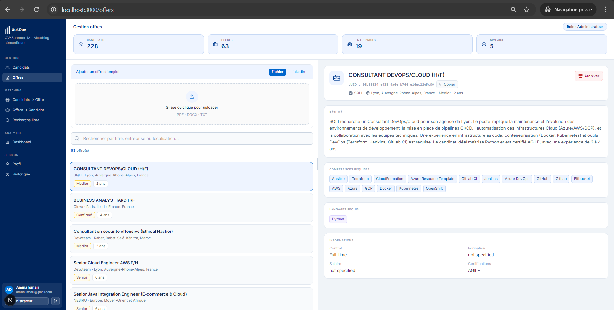
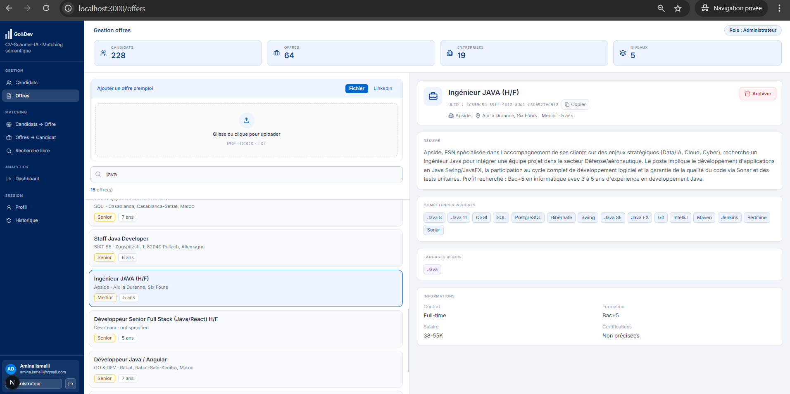

# Gestion Offres

La page Offres permet de consulter, uploader et archiver les offres d'emploi.



*Vue de gestion des offres d'emploi.*



*Affichage detaille d'une offre apres extraction et structuration.*

## Workflow

1. Rechercher une offre par titre, entreprise ou localisation.
2. Selectionner une offre.
3. Consulter les competences et langages requis.
4. Copier l'UUID.
5. Uploader une nouvelle offre.
6. Archiver l'offre si elle n'est plus active.

## APIs Utilisees

```text
GET    /api/jobs/titles/
GET    /api/jobs/{uuid}
POST   /api/upload/job/file
POST   /api/upload/from-url
DELETE /api/jobs/{uuid}?confirm=true&scope=archive
```

## Fichier Principal

```text
src/app/offers/page.tsx
```

## Interet Metier

Cette page donne une interface simple pour maintenir une base d'offres active avant de lancer le matching.
